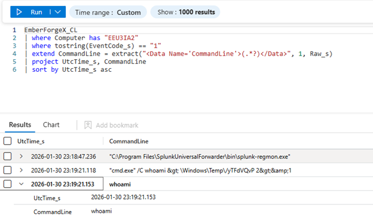
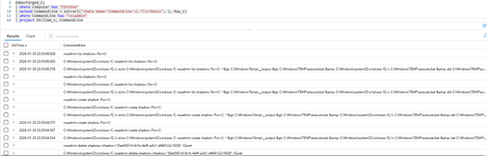
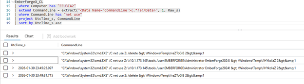
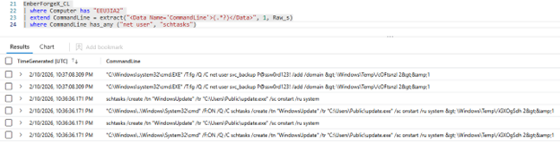
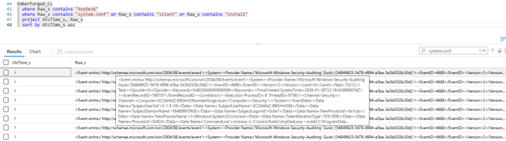
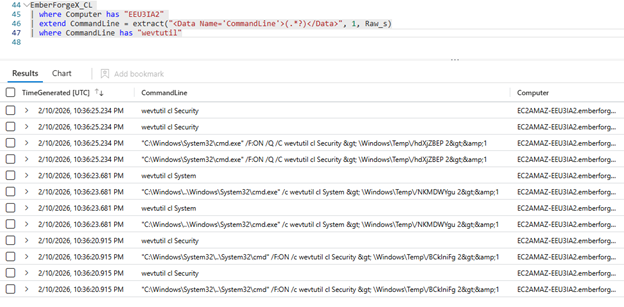

# Emberforge Threat Hunt Report

🛡️ **Threat Hunt Case Study: Operation EMBERFORGE // SOURCE LEAK**

---

## Executive Summary

On January 30, 2026, the primary Domain Controller `EEU3IA2` was compromised during a targeted attack. The adversary relied on legitimate Windows administrative tooling and living-off-the-land techniques to:

- Confirm system context and execute reconnaissance
- Create a Volume Shadow Copy to steal the Active Directory database
- Stage remote tools using cleartext credentials
- Establish persistence through a new privileged account and scheduled task
- Deploy AnyDesk as a remote access channel
- Evade detection by clearing Security and System event logs

This investigation was reconstructed using Sysmon telemetry, Azure Sentinel / Log Analytics, and KQL analysis.

---

## Incident Overview

- **Analyst:** Christian Martinez
- **Target Host:** `EEU3IA2` (Primary Domain Controller)
- **Date:** January 30, 2026
- **Tools:** Kusto Query Language (KQL), Azure Sentinel / Log Analytics, Sysmon

---

## Findings at a Glance

| Category | Finding |
|---|---|
| Initial discovery | `whoami` executed on host |
| Credential access | `vssadmin create shadow /for=C:` used to snapshot the system |
| Lateral movement | `net use Z: \\10.1.173.145\tools /user:EMBERFORGE\Administrator EmberForge2024!` |
| Persistence | New privileged user `svc_backup` and scheduled task `WindowsUpdate` |
| C2 / Remote access | AnyDesk installed and configured via `system.conf` |
| Defense evasion | `wevtutil` used to clear Security and System logs |

---

## Technical Deep Dive

### Phase 1: Initial Discovery (T1033)

**Objective:** Confirm the attacker’s operating context.

**KQL Query:**
```kql
EmberForgeX_CL
| where Computer has "EEU3IA2"
| where tostring(EventCode_s) == "1"
| project UtcTime_s, CommandLine
| sort by UtcTime_s asc
```

**Finding:** `whoami`

**Analysis:** The adversary confirmed the account context before proceeding with privilege escalation and data access.



---

### Phase 2: Credential Access (T1003.003)

**Objective:** Identify how the attacker bypassed file locks for `NTDS.dit`.

**KQL Query:**
```kql
EmberForgeX_CL
| where Computer has "EEU3IA2"
| extend CommandLine = extract("<Data Name='CommandLine'>(.*?)</Data>", 1, Raw_s)
| where CommandLine has "vssadmin"
| project UtcTime_s, CommandLine
```

**Finding:** `vssadmin create shadow /for=C:`

**Analysis:** The attacker used Volume Shadow Copy Service to produce a snapshot of the system volume, enabling offline access to locked files such as the Active Directory database.



---

### Phase 3: Lateral Movement Credentials

**Objective:** Recover credentials exposed during remote share access.

**KQL Query:**
```kql
EmberForgeX_CL
| where Computer has "EEU3IA2"
| extend CommandLine = extract("<Data Name='CommandLine'>(.*?)</Data>", 1, Raw_s)
| where CommandLine has "net use"
| project UtcTime_s, CommandLine
| sort by UtcTime_s asc
```

**Finding:** `EmberForge2024!`

**Analysis:** The attacker moved tools across the network using a writable share and cleartext credentials, indicating manual or semi-automated lateral movement.



---

### Phase 4: Persistence (User & System)

**Objective:** Identify persistence mechanisms created on the host.

**KQL Query:**
```kql
EmberForgeX_CL
| where Computer has "EEU3IA2"
| extend CommandLine = extract("<Data Name='CommandLine'>(.*?)</Data>", 1, Raw_s)
| where CommandLine has_any ("net user", "schtasks")
```

**Findings:**
- Added privileged account: `svc_backup`
- Scheduled task: `WindowsUpdate` executing `update.exe`

**Analysis:** Persistence was maintained via both account creation and a system-level scheduled task, increasing the attacker’s ability to regain access.



---

### Phase 5: Command & Control (C2)

**Objective:** Confirm remote access tool deployment and configuration.

**KQL Query:**
```kql
EmberForgeX_CL
| where Computer has "EEU3IA2"
| extend CommandLine = extract("<Data Name='CommandLine'>(.*?)</Data>", 1, Raw_s)
| where Raw_s has_any ("AnyDesk", "conf", "type")
```

**Finding:** AnyDesk installation and configuration of `C:\ProgramData\AnyDesk\system.conf`

**Analysis:** The attacker installed AnyDesk and enabled unattended remote access, creating a persistent GUI-based remote access channel that can evade standard detection.



---

### Phase 6: Defense Evasion (T1070.001)

**Objective:** Identify log-delete activity.

**KQL Query:**
```kql
EmberForgeX_CL
| where Computer has "EEU3IA2"
| where CommandLine has "wevtutil"
```

**Finding:** `wevtutil` used to clear `Security` and `System` logs

**Analysis:** The attacker attempted to remove forensic evidence from Windows event stores, underscoring the importance of centralized and immutable telemetry.



---

## Lessons Learned

- **Sysmon telemetry is essential.** The adversary deleted Windows event logs but could not erase Sysmon-based detection visibility if it was collected externally.
- **Living-off-the-land behavior is high risk.** Built-in tools such as `vssadmin`, `schtasks`, and `wevtutil` were used to perform the attack.
- **Unauthorized RMM tools are dangerous.** AnyDesk was used to establish a backdoor despite being a legitimate remote administration application.
- **Command line logging is critical.** The exposed password and exact command syntax were only recoverable because command-line process logging was available.

---

## Strategic Recommendations

1. **Deploy Sysmon on all Tier-0 assets** and forward logs to a centralized, immutable SIEM.
2. **Alert on sensitive administrative tool usage** when executed from unexpected accounts or with suspicious flags.
3. **Enforce application whitelisting** (AppLocker or equivalent) to block unauthorized remote management tools.
4. **Maintain long-term command-line telemetry retention** for forensic investigations.
5. **Assume credential compromise** for `EMBERFORGE\Administrator` and all accounts used during the incident; perform a full credential reset and AD remediation.

---

## Conclusion

The host `EEU3IA2` experienced a full domain compromise involving credential theft, persistence, remote access tool deployment, and log tampering. The reconstruction is reliable based on the telemetry available, and the organization should treat this as a high-confidence security incident with an immediate remediation priority.

---

**Report Prepared By:** Christian Martinez

**Date:** January 30, 2026
